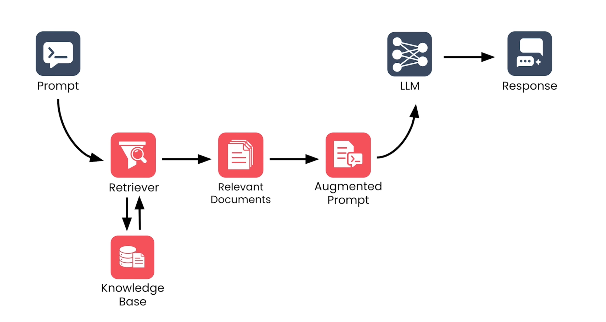

RAG = Retrieval-Augmented Generation

The pipeline of RAG:

    1, User input:
        Input: The user query (pure text)
        Process: The query is NOT sent to the LLM first. It is sent to the Retriever first.
        Output: The raw query passed on to the Retriever
        Reason: In RAG we fetch relevant context BEFORE the LLM sees the question

    2, Retriever:
        Input: The user query
        Process: Turn the query into a vector (embedding), then run a similarity search against the knowledge base (a vector database of pre-embedded document chunks), and return the top-k most relevant chunks
        Output: The relevant information/chunks that fit the context of the query
        Reason: To find additional information the LLM does not have (fresh or private data)
        Note: Matching is semantic (by meaning/similarity), not keyword. So "car" can match "vehicle" even without sharing words

    3, LLM (Generation):
        Input: The original query + the retrieved chunks, combined into one prompt
            (e.g. "Answer this question using only the following context: [chunks]... Question: [query]")
        Process: The LLM generates an answer grounded in the retrieved context
        Output: The final answer (ideally based on / citing the retrieved sources)
        Reason: Grounding the answer in real documents reduces hallucination and lets the
            model use data it was never trained on, without expensive retraining