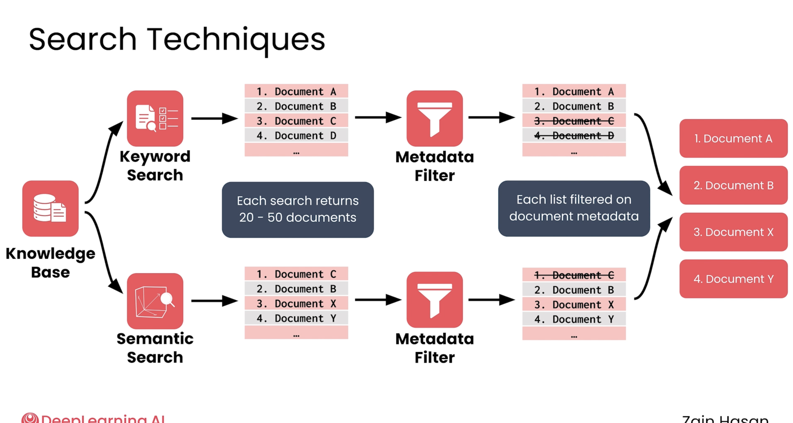

Search Techniques (Hybrid Search)

Two kinds of search:
    Keyword search (lexical): matches the exact words/terms in the user query
    Semantic search: matches by meaning using embeddings/vectors, so it can find a document even if the exact words are different
    Running BOTH of them together and combining the results is called "Hybrid Search".

The pipeline:

    1, Two searches run in parallel:
        Input: The user query
        Process: The knowledge base is searched two ways at the same time:
            - Keyword search
            - Semantic search
        Output: Each search returns its own list of about 20-50 documents
        Reason: The two methods find different good documents. Keyword is strong on exact terms; semantic is strong on meaning. Doing both gives better coverage.

    2, Metadata Filter (one filter per list):
        Input: Each 20-50 document list from step 1
        Process: Remove documents based on their metadata
            (e.g. date, author, category, language, access permissions)
            NOTE: this filters on metadata, NOT on relevance score
        Output: Two shorter, filtered document lists
        Reason: To drop documents that are not allowed or not relevant by their attributes
            (this is why some documents are crossed out in the diagram)

    3, Merge / Fusion (combine the two lists into one):
        Input: The two filtered lists from step 2
        Process: Merge the two lists into a single list and re-rank them
            (a common method is Reciprocal Rank Fusion, RRF)
        Output: One final ranked top-k list (e.g. Document A, B, X, Y)
        Reason: We need ONE ordered list of the best documents to send to the LLM.
            Merging combines the strengths of both searches into a single result.

Key point: we merge two LISTS OF DOCUMENTS into one list.
    We do NOT combine chunks into a smaller chunk.
    Order is always: search -> filter -> merge (the filter happens before the merge).